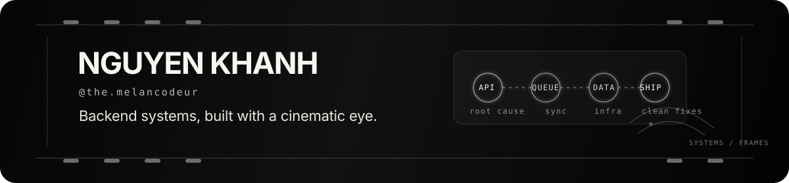

  

# Nguyen Khanh · @the.melancodeur

**Backend systems, built with a cinematic eye.**

I'm a freelance software developer focused on backend-heavy products, system correctness, and practical infrastructure. I like building the parts people rely on every day: APIs, data models, queues, reports, deployments, and the small decisions that keep systems stable after the demo ends.

> I care about root causes, clear boundaries, production behavior, and fixes that stay fixed.

<table>
<tr>
<td width="50%" valign="top">

### 01 · What I build

- **POS systems** — sales flows, inventory, reporting, operational backends.
- **HR platforms** — employee data, workflows, permissions, internal tools.
- **E-learning products** — content flows, user progress, platform APIs.
- **System plumbing** — queues, sync/CDC flows, background jobs, cache, deployment infrastructure.

</td>
<td width="50%" valign="top">

### 02 · How I work

- Debug from symptoms back to root cause.
- Design backend services with clear boundaries and boring reliability.
- Balance correctness, latency, maintainability, and operational cost.
- Prefer clean fixes over patches that merely survive the afternoon.
- Keep code understandable for the next person — frequently future me, unfortunately.

</td>
</tr>
</table>

## 03 · Tech I code with

## 04 · Outside code

I shoot street photographs and make short cinematic videos. Same instinct, different medium: timing, structure, detail, and mood.

## 05 · Contact

- GitHub: [@khanhtran719](https://github.com/khanhtran719)
- Creative signature: `@the.melancodeur`
